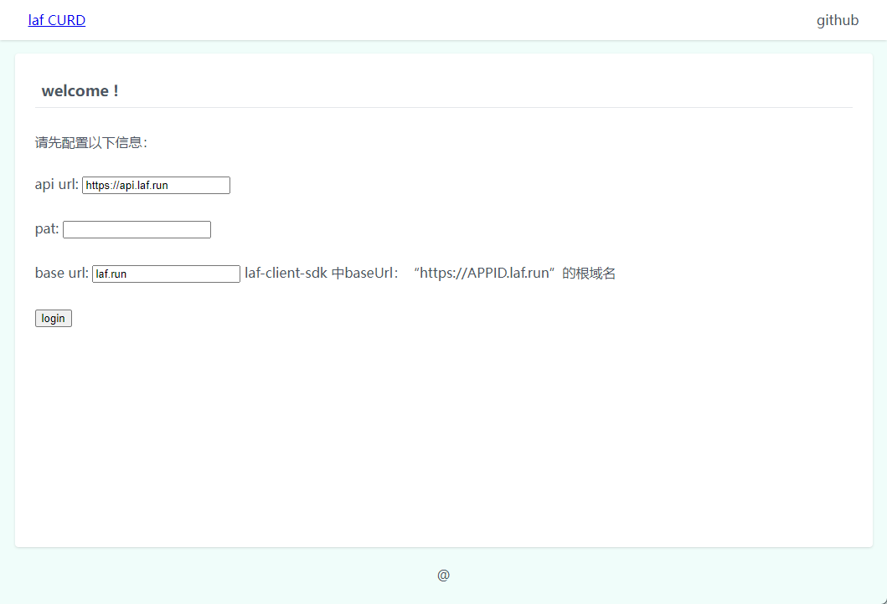
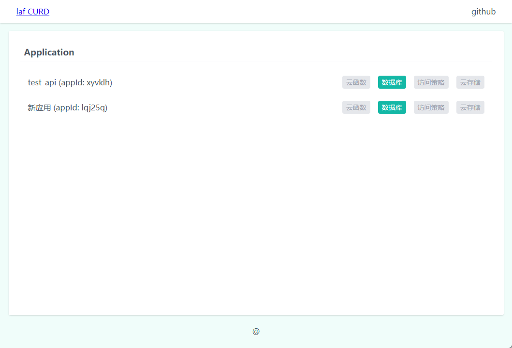
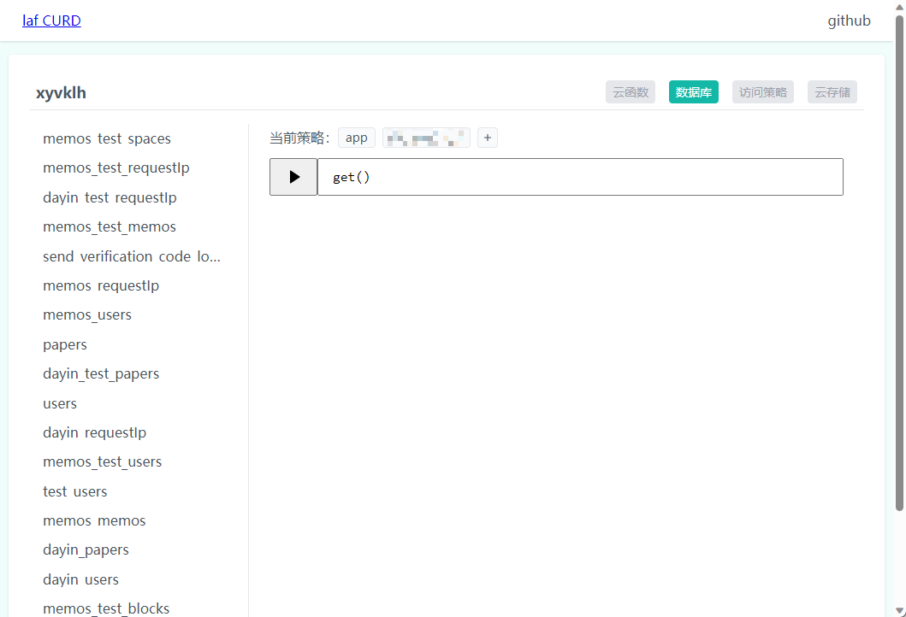
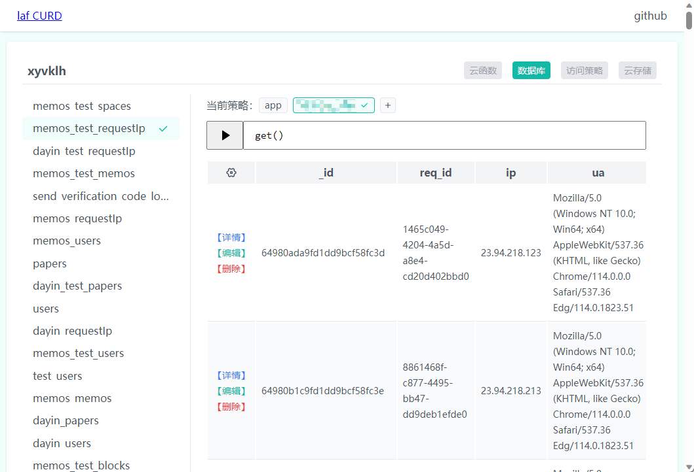

# Laf curd

一个 laf 的数据库管理工具。

- 访问 https://curd.muyi.dev/ 直接使用。
- 源码在这里 [NMTuan/laf_curd (github.com)](https://github.com/NMTuan/laf_curd)。

## 介绍

从名字不难看出，这是一个为 laf 云数据库设计的增删改查工具。

- 前端使用 `Nuxt v3` `Pinia` `Unocss`
- 后端对接 `laf api` `laf-client-sdk`

由于没有直接使用 UI 库，所以界面不咋好看。

为符合 MVP 最小可行性产品的方案，刚刚完成了 CURD 我就发了第一版 v0.1.0。

## 使用

首次打开后，是下面这么个丑样子，`api url` 和 `base url`按照你项目所在站点填即可（如果你是自建 laf，那你就好好研究下这俩参数吧，我也不知道咋搞）。然后填写 `pat` 参数即可（[如何创建pat？](https://doc.laf.run/guide/cli/#登录)）。



登录后会显示你当前账户下所有应用。



目前只有数据库一个功能，点击进入数据库管理界面。左侧显示当前所有数据集合，右侧首先显示的是访问策略，下面是执行查询语句的地方，最下面空白的区域就是显示查询结果的地方。



关于访问策略的介绍，你可以看[这里](https://doc.laf.run/guide/db/policy.html)。处于安全考虑，这里建议你点击后面的 `+` 随机创建一个新策略，在此策略下操作数据库。当使用完毕后登录 laf 官方平台删除刚刚创建的策略。

### 如何查询？

> ```
> cloud.database().collection("user").where({ age: _.gt(18) }.get()
> ```

我们可以在左侧点击 `user`集合，然后数据框中填写 `where({ age: _.gt(18) }).get()` 点击前方的 `▶`即可。

> 注意：这里是支持`_`关键字的。具体查询语句可以参考[官方手册](https://doc.laf.run/guide/db/find.html)。

最终可以看到类似下面的效果。



## 感谢

最后，感谢丰富的前端生态，感谢 laf 这个牛逼的产品。

- [Nuxt](https://github.com/nuxt/nuxt) MIT
- [Pinia](https://github.com/vuejs/pinia) MIT
- [Unocss](https://github.com/unocss/unocss) MIT
- [Laf](https://github.com/labring/laf) Apache License 2.0

如果你也喜欢 laf curd，或者本项目对你有所帮助。

可以[来这里点点 star🌟](https://github.com/NMTuan/laf_curd)。也或者[给作者加个鸡腿🍗🍗🍗](https://www.muyi.dev/sponsor)！
